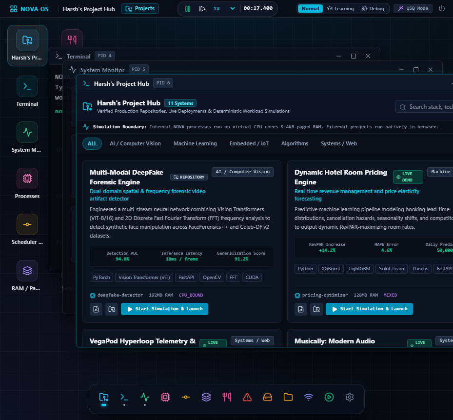
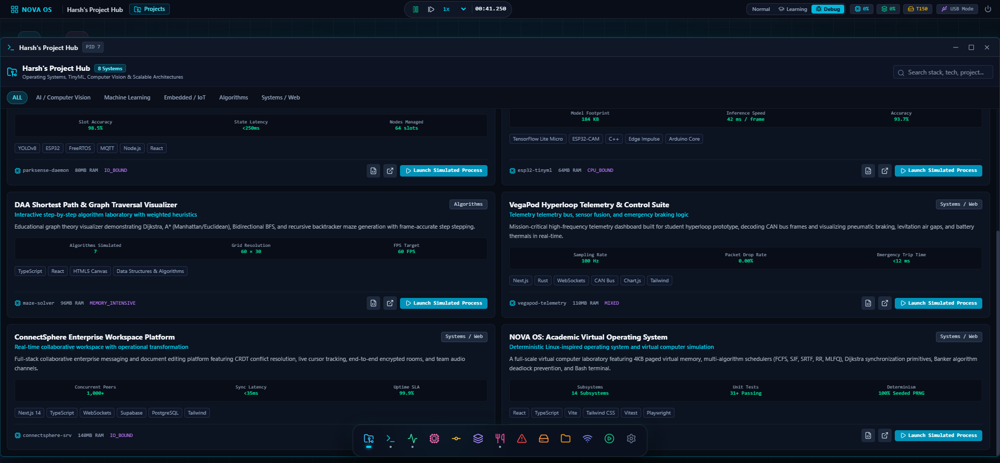
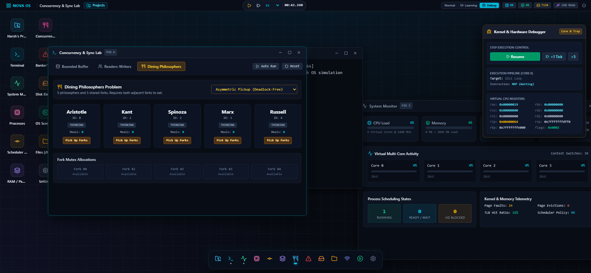
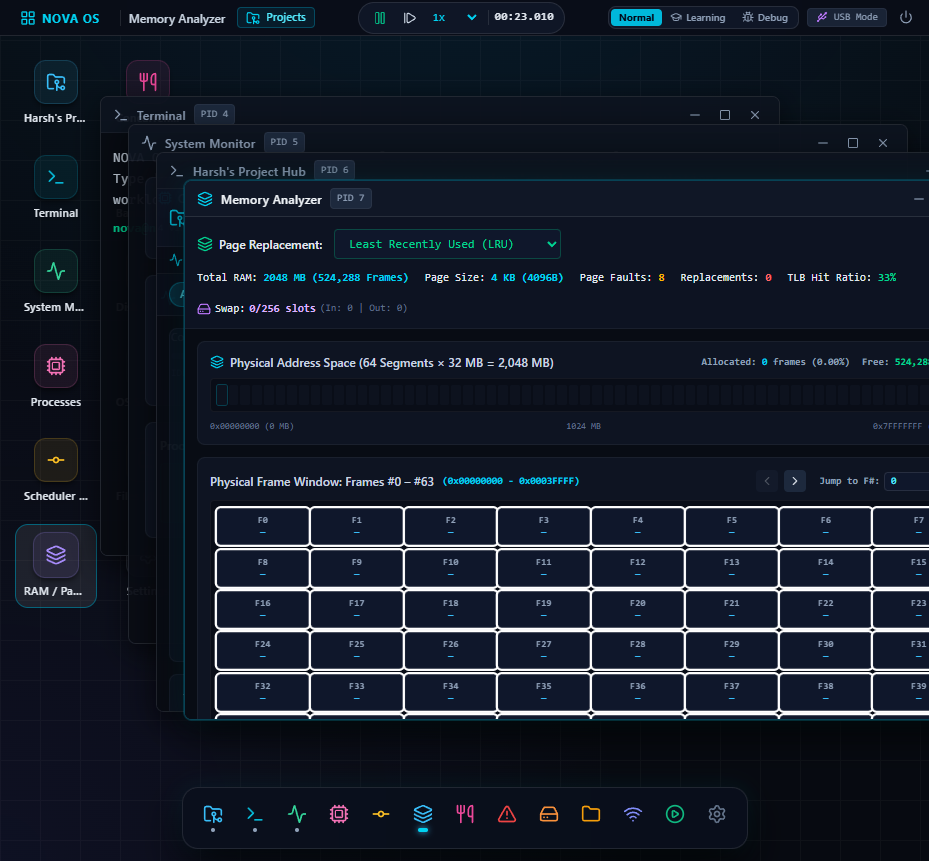
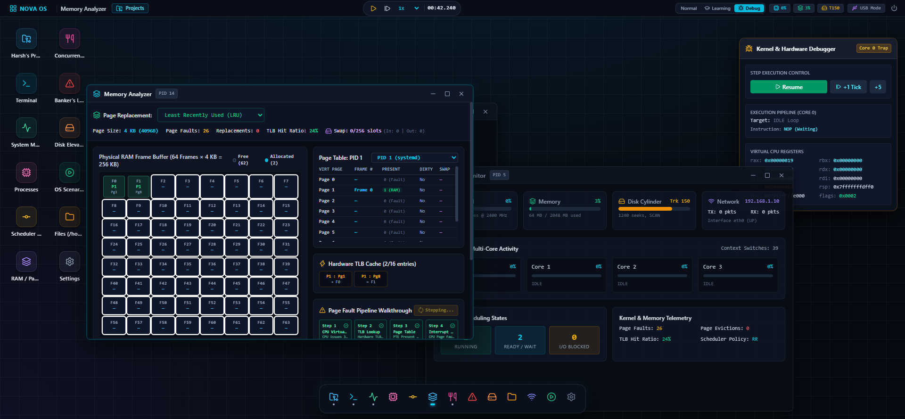
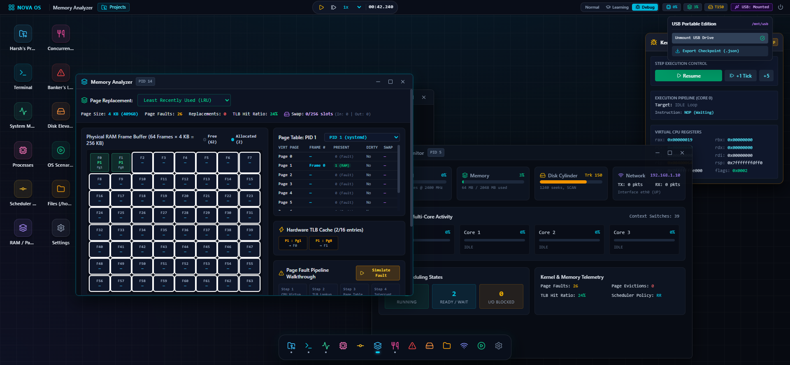
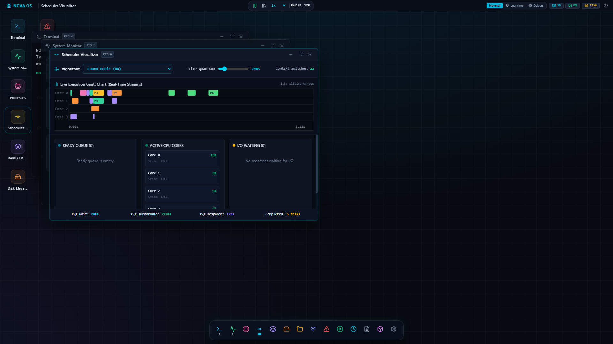
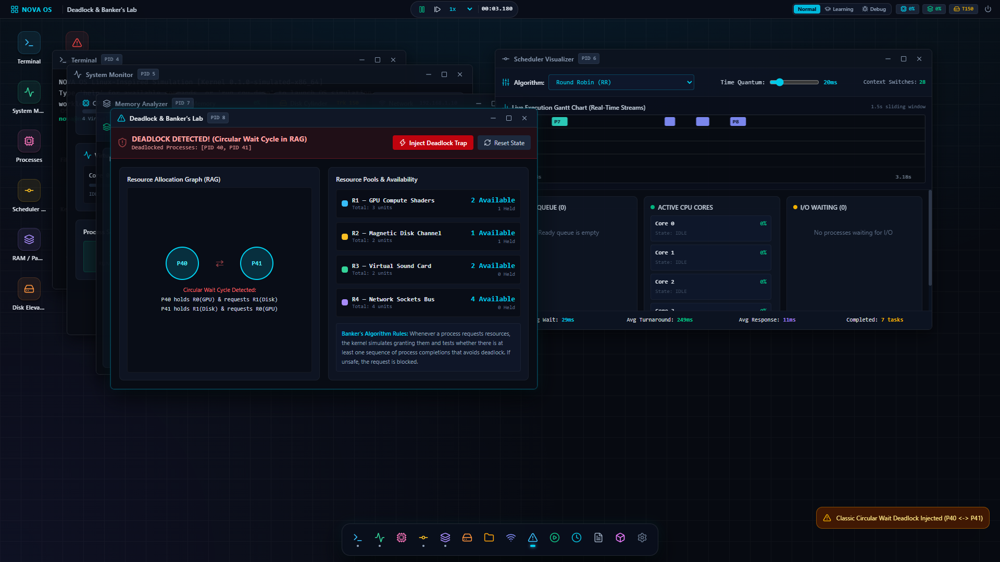
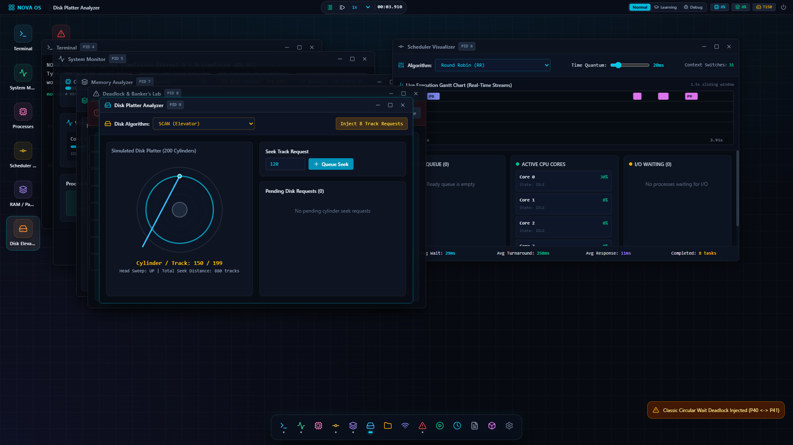

# NOVA OS — Simulated Operating System & Virtual Computer

[](file:///x:/Nova%20OS/src/tests)
[](file:///x:/Nova%20OS/docs/ARCHITECTURE.md)
[](file:///x:/Nova%20OS)
[](file:///x:/Nova%20OS/src/simulation/runtime/Random.ts)
[](file:///x:/Nova%20OS/src/storage/PortableStorage.ts)

**NOVA OS** is a fully simulated, deterministic, Linux-inspired computer and operating system. Built for advanced Operating Systems education, systems engineering analysis, university vivas, and research portfolios, it models real computer architecture principles from hardware interrupts and CPU register pipelines to user-space application execution.

Every pixel and metric displayed in NOVA OS is driven by the underlying simulation engine:
- If a CPU core shows **40% utilization**, that core actively computed 4 out of 10 instruction cycles.
- If a **page fault** occurs, the MMU translated a 32-bit virtual address, detected `present = 0`, issued Exception 0x0E, blocked the process, and loaded a 4KB page frame into physical RAM (524,288 frames for 2048 MB) with disk/swap telemetry.
- If a file is displayed in the File Manager, it exists with real inodes and Unix permissions in the Virtual File System.
- If a **deadlock** is reported, Tarjan’s cycle detection algorithm found an authentic circular wait cycle in the Resource Allocation Graph.
- If threads synchronize on a **Semaphore** or **Mutex**, classical Dijkstra wait/signal primitives govern the critical sections and blocked queues.

---

## 🏛️ System Architecture

```text
+-------------------------------------------------------------------------+
|                         HOST COMPUTER (BROWSER)                         |
|  React 19, TypeScript, Vite, Tailwind CSS v4, Lucide Icons, Vitest      |
+-------------------------------------------------------------------------+
                                    │
                                    ▼
+-------------------------------------------------------------------------+
|                         NOVA OS USER SPACE                              |
|  Harsh's Project Hub, Bash Terminal, File Manager, System Monitor,      |
|  Scheduler Lab, Memory Analyzer (4KB), Concurrency & Sync Lab,          |
|  Deadlock Lab, Disk Analyzer, Network Monitor, Portable USB Edition     |
+-------------------------------------------------------------------------+
                                    │  System Calls (trap / syscall)
                                    ▼
+-------------------------------------------------------------------------+
|                         NOVA OS KERNEL CORE                             |
|  Process Manager (PCB Table), CPU Scheduler (RR / SJF / MLFQ),          |
|  Memory Manager (4KB Paging, MMU & TLB), VFS & Inodes, Dynamic /proc,   |
|  Synchronization Engine (Semaphores / Mutexes), Deadlock Detector,      |
|  Disk Controller (SCAN / LOOK), Network Stack (eth0), Event Bus         |
+-------------------------------------------------------------------------+
                                    │  Virtual Hardware Control
                                    ▼
+-------------------------------------------------------------------------+
|                      NOVA OS VIRTUAL HARDWARE                           |
|  Virtual Multi-Core CPU (1-8 Cores), Physical RAM (524,288 x 4KB),      |
|  Virtual Cylinder Disk (200 Tracks), Virtual Network Adapter (eth0),   |
|  Interrupt Controller & Deterministic Mulberry32 Seeded PRNG Clock      |
+-------------------------------------------------------------------------+
```

---

## 📸 Visual Showcase & Subsystem Tour

| Harsh's Project Hub (Live Process Launcher) | Concurrency & Synchronization Lab |
|:---:|:---:|
|  |  |

| Dining Philosophers (Deadlock Prevention) | 4KB Paged Memory & MMU Translation |
|:---:|:---:|
|  |  |

| 8-Stage Animated Page Fault Pipeline | USB Portable Edition (/mnt/usb) |
|:---:|:---:|
|  |  |

| Desktop & System Monitor | Live Scheduler Gantt Chart |
|:---:|:---:|
|  |  |

| Banker's Algorithm & Deadlock Lab | Disk Platter & Actuator Arm |
|:---:|:---:|
|  |  |

---

## 🚀 Core Subsystems & Innovations

### 1. Harsh's Project Hub & Simultaneous Real-World Launch
- Native portfolio showcase presenting Harsh Shah's verified engineering systems:
  - **Multi-Modal DeepFake Forensic Engine** (ViT-B/16 + 2D FFT Frequency Analysis)
  - **Dynamic Hotel Room Pricing Engine** (XGBoost + RevPAR Revenue Optimization, live on Vercel)
  - **VegaPod Hyperloop Telemetry & Control Suite** (100Hz CAN bus decoding, live on Vercel)
  - **Musically Audio Streaming & Visualizer** (Web Audio API 60fps FFT spectrum, live on Vercel)
  - **SENTINEL Financial Fraud Detection** (Real-time Isolation Forest, live on Vercel)
  - **PenFight Web Physics Game** (2D rigid-body collision impulse engine, live on Vercel)
  - **ParkSense Smart Parking IoT** (YOLOv8 + ESP32 MQTT Mesh)
  - **ESP32-CAM TinyML Hand Gesture Recognizer** (Int8 Quantized CNN, 42ms edge latency)
  - **DAA Graph Traversal & Maze Algorithm Laboratory** (Dijkstra, A*, BFS)
  - **ConnectSphere Enterprise Workspace Platform** (CRDT Real-Time Collaboration)
  - **NOVA OS** (Self-referential virtual computer simulation)
- **Simultaneous Action ("Start Simulation & Launch")**:
  - Automatically initializes or reuses the authentic simulated process in NOVA OS (PID, PCB, virtual pages count, CPU burst instructions).
  - Simultaneously opens the actual project externally in a new browser tab (verified live Vercel deployment if active, otherwise verified GitHub repository).
  - Graceful browser popup fallback with notification banner if blocked.
  - Transparent execution boundaries: NOVA internal simulated CPU/RAM vs. external native browser execution.
- **Deterministic Workload Profiles**:
  - Process instruction streams are generated deterministically via seeded Mulberry32 PRNG (tensor matrix multiplications, CAN bus frames, XGBoost decision trees, FFT frequency spectrum calculations).
- **VFS Storage**: All projects are stored under `/home/nova/projects/<slug>/` containing real code files, `README.md`, and metadata.

### 2. Synchronization Lab (Classical Concurrency)
- **Dijkstra Counting & Binary Semaphores**: Classical `wait()` / `P()` and `signal()` / `V()` with waiting queues.
- **Mutual Exclusion Locks (Mutex)**: Strict PID ownership verification and handoff.
- **Bounded Buffer Problem**: Producer-Consumer ring buffer with empty and full semaphores. Includes a "Vulnerable Mode" toggle to demonstrate race conditions and data corruption!
- **Readers-Writers Problem**: Concurrent reader sharing with exclusive writer locking.
- **Dining Philosophers**: 5 philosophers and shared fork mutexes with Asymmetric pickup deadlock-free execution vs. Greedy circular wait deadlock demonstration.

### 3. Mathematical Virtual Memory & 4KB Paged Architecture
- **Strict 4KB Page Standard**: Page size is strictly 4096 bytes ($2^{12}$).
- **Address Breakdown**:
  - Virtual Page Number (VPN) = $\lfloor \text{VA} / 4096 \rfloor$ (20 bits)
  - Offset = $\text{VA} \pmod{4096}$ (12 bits)
  - Physical Address = $(\text{Frame Number} \times 4096) + \text{Offset}$
- **Hardware TLB Cache**: 16-entry high-speed translation cache with LRU eviction.
- **Swap Space Backing**: Evicted dirty pages (`isModified = true`) are swapped out to simulated disk swap slots and swapped in upon subsequent fault.
- **Interactive 8-Stage Page Fault Pipeline**: Step-by-step walkthrough of Exception 0x0E trap handling, process blocking, disk retrieval, frame mapping, and instruction restart.

### 4. Deterministic Simulation Clock & Seeded PRNG
- Driven by a deterministic **Mulberry32 32-bit PRNG** (`Random.ts`) seeded with `NOVA-2026-001`.
- Completely reproducible execution cycles, disk seek trajectories, and network latency traces for academic verification.
- **Speed Multipliers**: `0.1x`, `0.25x`, `0.5x`, `1.0x`, `2.0x`, `5.0x`, `10.0x` and single-tick stepping (`+10ms`).

### 5. Portable USB Storage Abstraction & Checkpoints
- Interface-driven storage: `MemoryStorage`, `BrowserStorage`, and `PortableStorage`.
- Simulates USB stick mounting to `/mnt/usb` with `autorun.inf`.
- **System Checkpoint Snapshotting**: Captures user files, scheduler algorithm, memory replacement policy, and settings into portable `.json` bundles with 1-click import and export.

### 6. CPU Scheduler & Multi-Core Execution
- 7 classical scheduling algorithms: Round Robin (RR), FCFS, SJF, SRTF, Priority with Aging, MLQ, and MLFQ.
- Streaming real-time canvas Gantt chart recording execution slices per virtual core.

### 7. Virtual File System (VFS) & Linux Shell
- Full Linux directory hierarchy (`/bin`, `/boot`, `/dev`, `/etc`, `/home/nova`, `/lib`, `/proc`, `/mnt/usb`, `/tmp`, `/var/log`).
- Unix permissions (`rwxr-xr--`), Inodes, and dynamic `/proc` handlers (`cpuinfo`, `meminfo`, `uptime`, `scheduler`, `processes`, `version`).
- Bash terminal with pipes (`|`), redirection (`>`, `>>`), history, and GNU utilities.

---

## 🧪 Automated Testing & Verification

NOVA OS includes a comprehensive Vitest test suite covering every core subsystem:

```bash
# Run the complete test suite
npx vitest run
```

```text
 ✓ src/tests/random.test.ts (3 tests)
 ✓ src/tests/memory.test.ts (4 tests)
 ✓ src/tests/sync.test.ts (4 tests)
 ✓ src/tests/vfs.test.ts (5 tests)
 ✓ src/tests/hardware.test.ts (6 tests)
 ✓ src/tests/scheduler.test.ts (4 tests)
 ✓ src/tests/shell.test.ts (4 tests)
 ✓ src/tests/storage.test.ts (3 tests)
 ✓ src/tests/kernel.test.ts (3 tests)

 Test Files  9 passed (9)
      Tests  36 passed (36)
   Duration  685ms
```

---

## 🛠️ Getting Started

```bash
# Clone the repository
git clone https://github.com/harshvshah12/nova-os.git
cd nova-os

# Install dependencies
npm install

# Start the Vite development server
npm run dev

# Build for production
npm run build
```

---

## 👨‍💻 Author

**Harsh Shah**  
- GitHub: [@harshvshah12](https://github.com/harshvshah12)  
- Email: harshvshah2019@gmail.com
