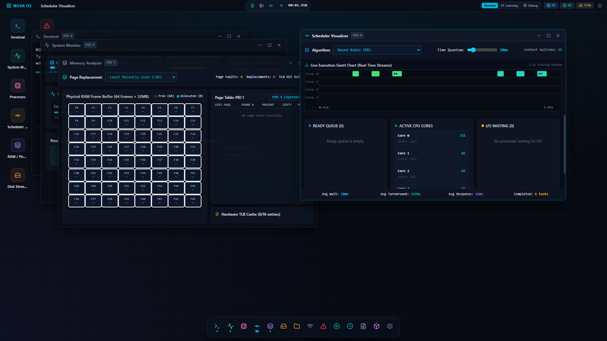
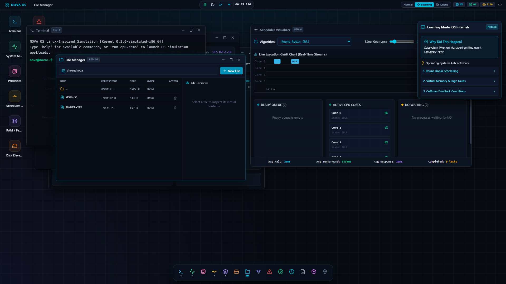

# NOVA OS — Simulated Operating System & Virtual Computer

[](file:///x:/Nova%20OS/src/tests)
[](file:///x:/Nova%20OS/docs/ARCHITECTURE.md)
[](file:///x:/Nova%20OS)

**NOVA OS** is a fully simulated, deterministic, Linux-inspired computer and operating system. Built for advanced Operating Systems education and systems engineering analysis, it models real computer architecture principles from hardware interrupts to user-space application execution.

Every pixel and metric displayed in NOVA OS is driven by the underlying simulation engine:
- If a CPU core shows **40% utilization**, that core actively computed 4 out of 10 instruction cycles.
- If a **page fault** is logged, the memory management unit encountered an unmapped virtual address and triggered an interrupt to load a physical frame.
- If a file is displayed in the File Manager, it exists with real inodes and Unix permissions in the Virtual File System.
- If a **deadlock** is reported, Tarjan’s cycle detection algorithm found an authentic circular wait cycle in the Resource Allocation Graph.

---

## 🏛️ System Architecture

```text
+-------------------------------------------------------------------------+
|                         NOVA OS USER SPACE                              |
|  Bash Terminal, File Manager, System Monitor, Scheduler Lab,            |
|  Memory Analyzer, Disk Platter Analyzer, Deadlock Lab, System Daemons   |
+-------------------------------------------------------------------------+
                                    │  System Calls (trap / syscall)
                                    ▼
+-------------------------------------------------------------------------+
|                         NOVA OS KERNEL CORE                             |
|  Process Manager (PCB Table), CPU Scheduler (RR / SJF / MLFQ),          |
|  Memory Manager (Paging & TLB), VFS & Inodes, Dynamic /proc Handlers,   |
|  Disk Controller (SCAN / LOOK), Network Stack (eth0), Event Bus         |
+-------------------------------------------------------------------------+
                                    │  Virtual Hardware Control
                                    ▼
+-------------------------------------------------------------------------+
|                      NOVA OS VIRTUAL HARDWARE                           |
|  Virtual Multi-Core CPU (1-8 Cores), Physical RAM Frames (64 Frames),   |
|  Virtual Cylinder Disk (200 Tracks), Virtual Network Adapter (eth0),   |
|  Interrupt Controller & Deterministic Simulation Clock                  |
+-------------------------------------------------------------------------+
```

---

## 📸 Visual Showcase & Subsystem Tour

| Desktop & System Monitor | Live Scheduler Gantt Chart |
|:---:|:---:|
|  |  |

| Memory Analyzer & 64-Frame RAM | Banker's Algorithm & Deadlock Lab |
|:---:|:---:|
|  |  |

| Disk Platter & Actuator Arm | Learning Mode ("Why Did This Happen?") |
|:---:|:---:|
|  |  |

---

## 🚀 Key Subsystems & Features

### 1. Deterministic Virtual Clock & Controls
- Decouples logical execution time (`simulationTime`) from wall-clock time.
- **Speed Multipliers**: `0.1x`, `0.25x`, `0.5x`, `1.0x`, `2.0x`, `5.0x`, `10.0x`.
- **Step Mode**: Step single clock tick (`+10ms`) or step individual instructions.

### 2. Virtual Hardware (x86_64 Inspired)
- **Multi-Core CPU**: Configurable 1 to 8 cores with cycle-by-cycle instruction execution and register banks (`rax`, `rbx`, `rcx`, `rdx`, `rsi`, `rdi`, `rsp`, `rbp`, `rip`, `flags`).
- **Physical RAM**: 64 physical frames (each representing 32MB) with reference bits, dirty bits, and allocation telemetry.
- **Cylinder Disk**: 200 concentric cylinders (tracks 0 to 199) with simulated seek latency, head direction, and rotational delay.
- **Network Interface (`eth0`)**: Virtual IP `192.168.1.10`, MAC address, packet transmission queues, and ICMP ping latency.

### 3. CPU Scheduler (7 Classical Algorithms)
- **Round Robin (RR)**: Preemptive time-slice scheduling with configurable quantum (10ms - 80ms) and FIFO arrival ordering.
- **First-Come, First-Served (FCFS)**: Non-preemptive FIFO dispatch.
- **Shortest Job First (SJF)**: Greedy burst selection.
- **Shortest Remaining Time First (SRTF)**: Preemptive burst-based dispatch.
- **Priority Scheduling**: Static and dynamic priority with aging to prevent starvation.
- **Multilevel Queue (MLQ)**: System, Interactive, and Batch priority queues.
- **Multilevel Feedback Queue (MLFQ)**: Adaptive demotion and periodic priority boosts.
- **Live Gantt Chart**: Streaming real-time canvas visualizer rendering colored execution slices per core.

### 4. Virtual Memory & Paging System
- **Paged Address Spaces**: Virtual pages translated to physical frames via per-process Page Tables.
- **Hardware TLB Cache**: 16-entry high-speed translation cache with hit/miss tracking.
- **Page Fault Trap (Interrupt 0x0E)**: Triggered on unmapped address references. Allocates free frame or evicts existing frame.
- **Replacement Algorithms**:
  - `LRU` (Least Recently Used)
  - `FIFO` (First-In, First-Out)
  - `OPTIMAL` (Belady's lookahead algorithm)

### 5. Virtual File System (VFS) & Shell
- Complete Linux hierarchy: `/bin`, `/boot`, `/dev`, `/etc`, `/home/nova`, `/lib`, `/proc`, `/tmp`, `/usr/bin`, `/var/log`.
- Inode table tracking Unix permissions (`rwxr-xr--`), UID, GID, and sizes.
- **Dynamic `/proc` Generation**:
  - `cat /proc/cpuinfo` — Real cores, frequency, and load
  - `cat /proc/meminfo` — Real physical frame allocation & page faults
  - `cat /proc/uptime` — Exact simulation elapsed time
  - `cat /proc/scheduler` — Active algorithm, quantum, and metrics
- **Bash Shell**: Supports pipelines (`|`), output redirection (`>`, `>>`), command history (Up/Down arrows), tab autocompletion, and signals (`kill -9`, `SIGTERM`, `SIGSTOP`).

### 6. Concurrency & Deadlock Engine
- **Resource Allocation Graph (RAG)**: Visualizes process nodes, resource nodes, claim edges, and assignment edges.
- **Cycle Detection**: Detects circular wait deadlocks in real-time.
- **Banker's Algorithm**: Evaluates allocation and need matrices against available resources to guarantee safe sequences.
- **Deadlock Trap**: 1-click injection of classic circular wait dependencies for educational analysis.

### 7. Educational & Debug Modes
- **Learning Mode ("Why Did This Happen?")**: Real-time causal explanations citing OS theory whenever a context switch occurs, page fault traps fire, or I/O blocks a process.
- **Debug Mode**: Instruction stepper, register inspector, program counter viewer, and TLB cache state.

---

## 🛠️ Technology Stack

- **Runtime**: Vite, React 19, TypeScript
- **Styling**: Tailwind CSS v4, Lucide React
- **State & Simulation Engine**: Zustand, custom deterministic virtual clock, event bus, priority queues
- **Visualization**: Canvas & SVG for Gantt charts, memory frame maps, disk platter head sweeps
- **Testing**: Vitest test suite with 23 unit and integration tests

---

## 🧪 Automated Test Suite

NOVA OS includes a comprehensive Vitest test suite validating the mathematical correctness of all OS algorithms:

```bash
npx vitest run
```

```text
✓ src/tests/vfs.test.ts (4 tests)
✓ src/tests/memory.test.ts (2 tests)
✓ src/tests/hardware.test.ts (6 tests)
✓ src/tests/scheduler.test.ts (4 tests)
✓ src/tests/shell.test.ts (4 tests)
✓ src/tests/kernel.test.ts (3 tests)

Test Files  6 passed (6)
     Tests  23 passed (23)
```

---

## 💻 Quick Start

### Development Server
```bash
npm install
npm run dev
```
Open [http://localhost:3000](http://localhost:3000) in any modern browser.

### Production Build
```bash
npm run build
```

---

## 📖 Command Reference

| Command | Description | Example |
| :--- | :--- | :--- |
| `ls [-la]` | List directory contents | `ls -la /etc` |
| `cd <path>` | Change working directory | `cd /home/nova` |
| `cat <file>` | Display file contents | `cat /proc/cpuinfo` |
| `ps` | List active processes | `ps` |
| `top` | Dynamic process and system summary | `top` |
| `kill [-9]` | Send signal to simulated process | `kill -9 15` |
| `free` | Display RAM and frame usage | `free` |
| `df` | Display disk usage | `df` |
| `ifconfig` | Display virtual network interface | `ifconfig` |
| `ping <ip>` | Send simulated ICMP echo packets | `ping 192.168.1.1` |
| `run <demo>` | Spawn predefined workload | `run cpu-demo` |
| `su <user>` | Switch user session | `su root` |
| `pkg list` | List installed packages | `pkg list` |
| `service` | Query background daemons | `service status loggerd` |
| `tree` | Graphical directory hierarchy | `tree /etc` |

---

## 🎓 Academic Concepts Demonstrated

1. **Process Lifecycle**: Transitioning across `NEW`, `READY`, `RUNNING`, `BLOCKED`, `SUSPENDED`, and `TERMINATED`.
2. **CPU Scheduling**: Preemption, time quanta, Gantt streaming, turnaround time, waiting time, and starvation aging.
3. **Virtual Memory**: Address translation, page tables, TLB hits/misses, page fault traps, and LRU frame eviction.
4. **Secondary Storage**: Cylinder seek geometry and elevator disk scheduling algorithms (SCAN, LOOK, SSTF).
5. **Virtual File Systems**: Hierarchical inode trees, Unix permission bits (`chmod`, `chown`), and dynamic pseudofiles (`/proc`).
6. **Deadlock Prevention**: Coffman conditions, Resource Allocation Graphs, and Dijkstra's Banker's Algorithm.
