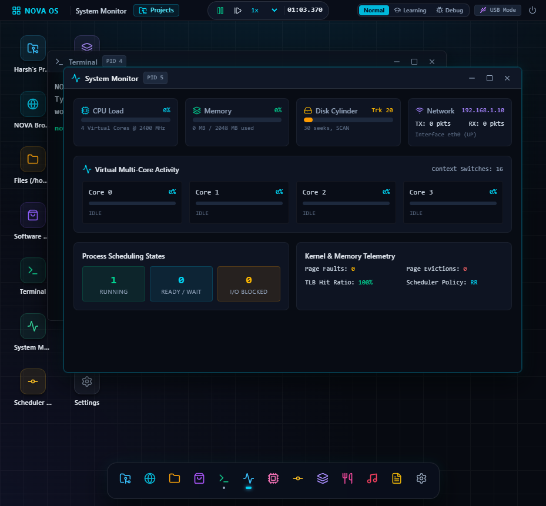
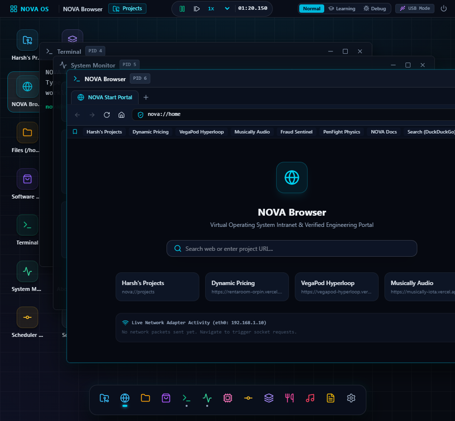
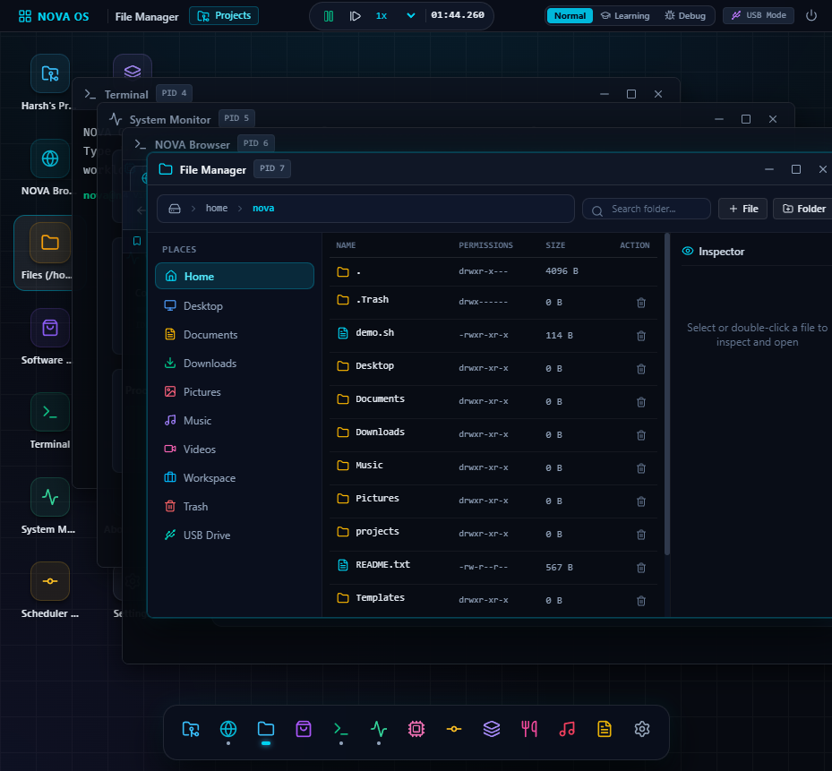
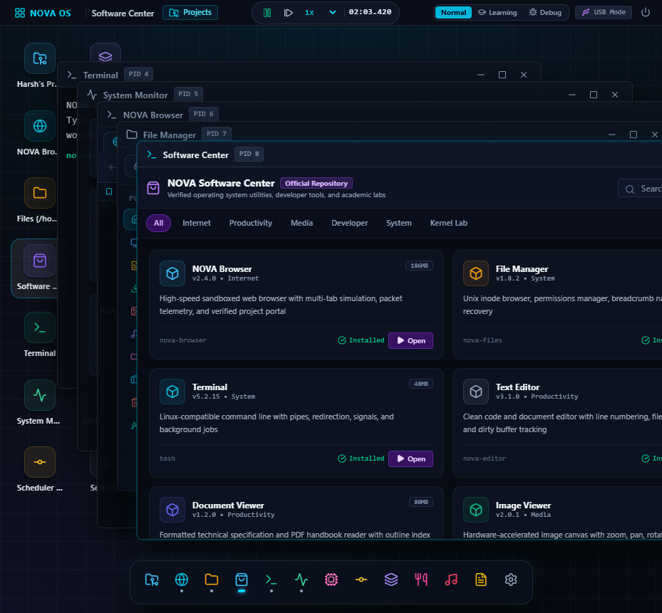
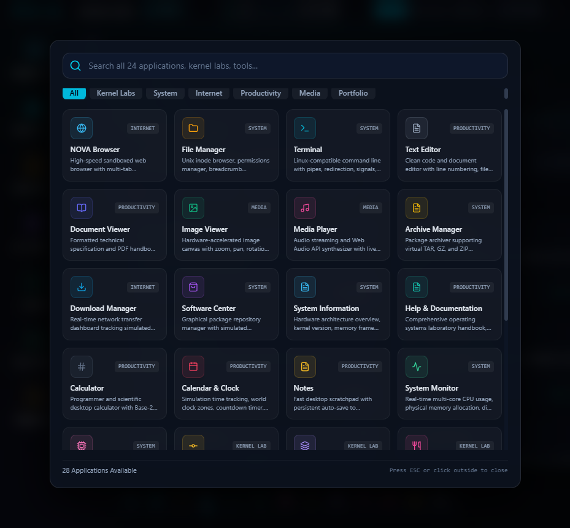

# NOVA OS — Simulated Operating System & Virtual Computer

[](file:///x:/Nova%20OS/src/tests)
[](file:///x:/Nova%20OS/docs/ARCHITECTURE.md)
[](file:///x:/Nova%20OS)
[](file:///x:/Nova%20OS/src/simulation/runtime/Random.ts)
[](file:///x:/Nova%20OS/src/storage/PortableStorage.ts)
[](file:///x:/Nova%20OS/src/simulation/applications/ApplicationRegistry.ts)

**NOVA OS** is a fully simulated, deterministic, Linux-inspired computer and desktop operating system. Built for advanced Operating Systems education, systems engineering analysis, university vivas, and research portfolios, it models real computer architecture principles from hardware interrupts and CPU register pipelines to user-space desktop applications.

Every pixel and metric displayed in NOVA OS is driven by the underlying simulation engine:
- If a CPU core shows **40% utilization**, that core actively computed 4 out of 10 instruction cycles.
- If a **page fault** occurs, the MMU translated a 32-bit virtual address, detected `present = 0`, issued Exception 0x0E, blocked the process, and loaded a 4KB page frame into physical RAM (524,288 frames for 2048 MB) with disk/swap telemetry.
- If a file is displayed in the File Manager, it exists with real inodes and Unix permissions in the Virtual File System, supports automatic MIME file opening, and can be moved to or restored from `.Trash`.
- If a **deadlock** is reported, Tarjan’s cycle detection algorithm found an authentic circular wait cycle in the Resource Allocation Graph.
- If threads synchronize on a **Semaphore** or **Mutex**, classical Dijkstra wait/signal primitives govern the critical sections and blocked queues.

---

## 🏛️ System Architecture

```text
+-------------------------------------------------------------------------+
|                         HOST COMPUTER (BROWSER)                         |
|  React 19, TypeScript, Vite, Tailwind CSS v4, Lucide Icons, Vitest      |
+-------------------------------------------------------------------------+
                                    │
                                    ▼
+-------------------------------------------------------------------------+
|                         NOVA OS USER SPACE                              |
|  28 Native Applications & Desktop Environment:                          |
|  - NOVA Browser, File Manager, Software Center, Project Hub, Terminal   |
|  - System Monitor, Process Manager, System Info, Help Docs, Notes       |
|  - Document Viewer, Image Viewer, Media Player, Archive Manager         |
|  - Scheduler Lab, Memory Analyzer (4KB), Concurrency Lab, Banker's Lab  |
|  - Disk Elevator, Network Monitor, OS Scenarios, Download Manager       |
+-------------------------------------------------------------------------+
                                    │  System Calls (trap / syscall)
                                    ▼
+-------------------------------------------------------------------------+
|                         NOVA OS KERNEL CORE                             |
|  Process Manager (PCB Table), CPU Scheduler (RR / SJF / MLFQ),          |
|  Memory Manager (4KB Paging, MMU & TLB), VFS & Inodes, Dynamic /proc,   |
|  Synchronization Engine (Semaphores / Mutexes), Deadlock Detector,      |
|  Disk Controller (SCAN / LOOK), Network Stack (eth0), Event Bus         |
+-------------------------------------------------------------------------+
                                    │  Virtual Hardware Control
                                    ▼
+-------------------------------------------------------------------------+
|                      NOVA OS VIRTUAL HARDWARE                           |
|  Virtual Multi-Core CPU (1-8 Cores), Physical RAM (524,288 x 4KB),      |
|  Virtual Cylinder Disk (200 Tracks), Virtual Network Adapter (eth0),   |
|  Interrupt Controller & Deterministic Mulberry32 Seeded PRNG Clock      |
+-------------------------------------------------------------------------+
```

---

## 📸 Visual Showcase & Desktop Tour

| Desktop Overview & Live Multi-Window Multitasking | NOVA Sandboxed Web Browser |
|:---:|:---:|
|  |  |

| File Manager (MIME Associations & Trash Recovery) | Graphical Software Center |
|:---:|:---:|
|  |  |

| 28-App Categorized Application Launcher | Harsh's Project Hub (Live Process Launcher) |
|:---:|:---:|
|  |  |

| Concurrency & Synchronization Lab | Dining Philosophers (Deadlock Prevention) |
|:---:|:---:|
|  |  |

| 4KB Paged Memory & MMU Translation | 8-Stage Animated Page Fault Pipeline |
|:---:|:---:|
|  |  |

| Live Scheduler Gantt Chart | USB Portable Edition (/mnt/usb) |
|:---:|:---:|
|  |  |

---

## 🖥️ Preinstalled 28-Application Ecosystem

Every application in NOVA OS is registered in the centralized [`ApplicationRegistry`](src/simulation/applications/ApplicationRegistry.ts) with strict workload profiles, memory allocation constraints, and process priority:

### 1. System & Utilities
- **Terminal (`/bin/sh`)**: Authentic shell with piping (`|`), output redirection (`>`, `>>`), signal sending (`kill -9`), and background job monitoring.
- **File Manager**: Directory navigation with Places sidebar, breadcrumbs, search, new file/folder creation, MIME double-click dispatch, and `/home/nova/.Trash` recovery.
- **Process Manager**: Real-time PCB inspector, state transitions (READY, RUNNING, BLOCKED, TERMINATED), nice values, and signal dispatch.
- **System Monitor**: Live multi-core CPU meters, 4KB RAM usage breakdown, disk throughput, and network packet graphs.
- **System Information**: Neofetch / Ubuntu style hardware overview (virtual CPU cores, 524,288 frame buffer, disk heads, network adapter, uptime).
- **Settings**: Multi-tab configuration for CPU cores, appearance wallpapers (Dark Obsidian, Cyber Matrix, Deep Space, Tokyo Sunset), scheduling algorithms, and network parameters.
- **Software Center**: GUI package manager with dependency checks, download simulation, and binary extraction to `/usr/bin/`.
- **Package Manager (CLI)**: Low-level terminal package utility.

### 2. Internet & Networking
- **NOVA Browser**: Multi-tab web browser with URL bar, history, bookmarks, child renderer processes (`browser-renderer-N`), simulated DNS resolution (`1.1.1.1`), TCP packet transmission, and real iframe sandboxing for verified web projects.
- **Network Monitor**: Virtual `eth0` interface telemetry, packet transmission stream, and ICMP ping tool.
- **Download Manager**: Real-time download queue tracking simulated TCP socket chunks and disk buffer flush.

### 3. Productivity & Media
- **Document Viewer**: Formatted specification reader and Markdown viewer with outline sidebar, zoom, and search.
- **Text Editor**: Full-featured code and text editor with dirty buffer tracking, line numbers, and disk I/O track seeks.
- **Quick Notes**: Desktop memo pad auto-saved to `/home/nova/Documents/notes.txt` with color themes.
- **Calculator**: Desktop arithmetic calculator accessory.
- **Calendar & Clock**: Live analog/digital clock, monthly calendar grid, countdown stopwatch timer, and system agenda.
- **Help & Documentation**: Built-in comprehensive operating systems handbook, command reference, and architecture guide.
- **Media Player**: Web Audio API frequency synthesizer with live 60fps canvas spectrum visualizer, playlist, and audio playback.
- **Image Viewer**: Vector SVG and bitmap image viewer with zoom, rotation, and metadata inspector.
- **Archive Manager**: Archive reader and creator supporting `.tar.gz` and `.zip` with real-time compression telemetry.

### 4. Kernel Labs & Portfolio
- **Harsh's Project Hub**: Showcase presenting Harsh Shah's verified software systems with simultaneous dual-action execution (spawns simulated process + opens live external project).
- **Scheduler Lab**: Real-time Gantt chart comparing Round Robin, Shortest Job First, Priority with Aging, and MLFQ.
- **Memory Analyzer**: 4KB paged virtual memory map with 524,288 physical frames, page table traversal, and TLB telemetry.
- **Concurrency & Sync Lab**: Dijkstra counting semaphores, mutexes, bounded buffer, readers-writers, and dining philosophers.
- **Banker's Lab**: Resource Allocation Graph (RAG), Tarjan cycle detector, and Edsger Dijkstra safety test.
- **Disk Elevator**: Animated 200-track cylinder platter with SCAN, LOOK, and SSTF seek head scheduling.
- **OS Scenarios Lab**: 1-click academic lab demonstrations simulating Thrashing, CPU Bursts, and Deadlocks.
- **Event Timeline**: Chronological kernel interrupt and system call audit log.

---

## 🧪 Automated Testing & Verification

NOVA OS includes a comprehensive Vitest test suite covering every core subsystem:

```bash
# Run the complete test suite
npx vitest run
```

```text
 ✓ src/tests/application_registry.test.ts (4 tests)
 ✓ src/tests/desktop_ecosystem.test.ts (4 tests)
 ✓ src/tests/vfs_trash.test.ts (5 tests)
 ✓ src/tests/random.test.ts (3 tests)
 ✓ src/tests/memory.test.ts (4 tests)
 ✓ src/tests/memory_math.test.ts (4 tests)
 ✓ src/tests/sync.test.ts (4 tests)
 ✓ src/tests/project_runtime.test.ts (4 tests)
 ✓ src/tests/hardware.test.ts (6 tests)
 ✓ src/tests/scheduler.test.ts (4 tests)
 ✓ src/tests/vfs.test.ts (5 tests)
 ✓ src/tests/shell.test.ts (4 tests)
 ✓ src/tests/storage.test.ts (3 tests)
 ✓ src/tests/kernel.test.ts (3 tests)

 Test Files  14 passed (14)
      Tests  57 passed (57)
   Duration  732ms
```

---

## 🛠️ Getting Started

```bash
# Clone the repository
git clone https://github.com/harshvshah12/nova-os.git
cd nova-os

# Install dependencies
npm install

# Start the Vite development server
npm run dev

# Build for production
npm run build
```

---

## 👨‍💻 Author

**Harsh Shah**  
- GitHub: [@harshvshah12](https://github.com/harshvshah12)  
- Email: harshvshah2019@gmail.com
